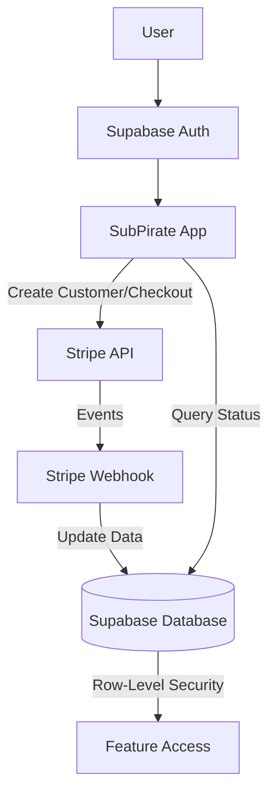
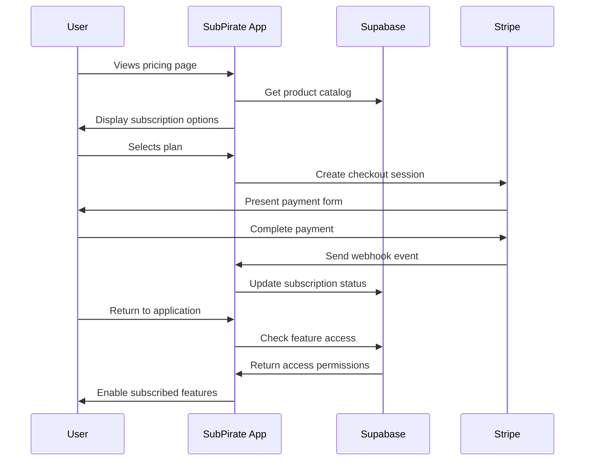
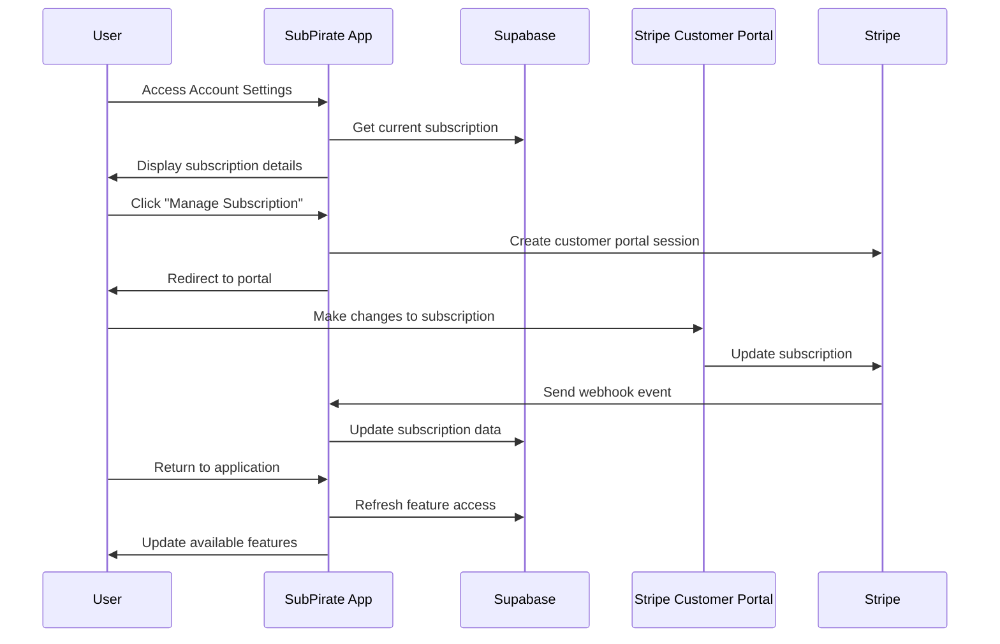
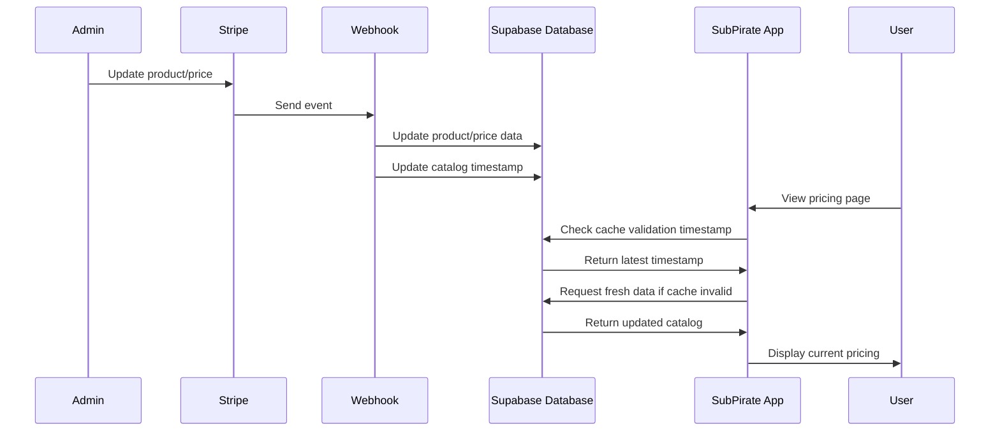

# Stripe Integration Guide for SubPirate

This comprehensive guide details the complete Stripe integration for the SubPirate application, including subscription management, product/price synchronization, webhook handling, caching strategies, and database schema.

## Table of Contents

1. [Architecture Overview](#architecture-overview)
2. [System Components](#system-components)
3. [User Flows](#user-flows)
4. [Database Schema](#database-schema)
5. [API Endpoints](#api-endpoints)
6. [Client-Side Implementation](#client-side-implementation)
7. [Server-Side Implementation](#server-side-implementation)
8. [Product/Price Synchronization](#productprice-synchronization)
9. [Webhook Processing](#webhook-processing)
10. [Caching Strategy](#caching-strategy)
11. [Feature Access Control](#feature-access-control)
12. [Security Considerations](#security-considerations)
13. [Setup Instructions](#setup-instructions)
14. [Testing and Troubleshooting](#testing-and-troubleshooting)
15. [Maintenance](#maintenance)

## Architecture Overview

The Stripe integration leverages Supabase for database storage and authentication, with direct integration to Stripe's API for subscription management. The system uses webhooks to keep subscription data in sync and implements client-side caching with server validation for improved performance.



## System Components

The Stripe integration consists of the following major components:

1. **Database Layer**
   - Subscription data storage
   - Product and price catalog
   - Feature access control
   - Row-Level Security (RLS) policies

2. **Server API Layer**
   - Webhook handler for Stripe events
   - Checkout session creation
   - Customer portal creation
   - Product/price endpoints

3. **Client Layer**
   - Pricing page
   - Subscription management UI
   - Feature-gated UI components
   - Local caching with server validation

4. **Data Synchronization**
   - Real-time updates via webhooks
   - Manual sync scripts
   - Cache invalidation system
   - Obsolete data cleaning

## User Flows

### Subscription Flow



### Managing Subscription Flow



### Product/Price Sync Flow



## Database Schema

### stripe_products Table

Stores product information from Stripe:

| Column             | Type          | Description                           |
|--------------------|---------------|---------------------------------------|
| id                 | UUID          | Primary key                           |
| stripe_product_id  | TEXT          | Stripe product ID                     |
| name               | TEXT          | Product name                          |
| description        | TEXT          | Product description                   |
| active             | BOOLEAN       | Whether product is active             |
| metadata           | JSONB         | Additional product metadata           |
| created_at         | TIMESTAMP     | Creation timestamp                    |
| updated_at         | TIMESTAMP     | Last update timestamp                 |

### stripe_prices Table

Stores price information from Stripe:

| Column                  | Type          | Description                       |
|-------------------------|---------------|-----------------------------------|
| id                      | TEXT          | Stripe price ID (primary key)     |
| stripe_price_id         | TEXT          | Stripe price ID (duplicate)       |
| stripe_product_id       | TEXT          | Associated product ID             |
| unit_amount             | INTEGER       | Price amount in cents             |
| currency                | TEXT          | Price currency                    |
| active                  | BOOLEAN       | Whether price is active           |
| recurring_interval      | TEXT          | Billing interval (month, year)    |
| recurring_interval_count| INTEGER       | Number of intervals               |
| created_at              | TIMESTAMP     | Creation timestamp                |
| updated_at              | TIMESTAMP     | Last update timestamp             |

### system_settings Table

Stores system-wide settings, including cache invalidation timestamps:

| Column             | Type          | Description                           |
|--------------------|---------------|---------------------------------------|
| id                 | UUID          | Primary key                           |
| key                | TEXT          | Setting name                          |
| value              | JSONB         | Setting value                         |
| created_at         | TIMESTAMP     | Creation timestamp                    |
| updated_at         | TIMESTAMP     | Last update timestamp                 |

### stripe_webhook_events Table

Tracks processed webhook events to prevent duplicate processing:

| Column             | Type          | Description                           |
|--------------------|---------------|---------------------------------------|
| id                 | UUID          | Primary key                           |
| event_id           | TEXT          | Stripe event ID                       |
| event_type         | TEXT          | Type of event                         |
| idempotency_key    | TEXT          | Optional idempotency key              |
| event_timestamp    | TIMESTAMP     | When event occurred                   |
| created_at         | TIMESTAMP     | When event was processed              |

### profiles Table

Contains user information, including Stripe customer ID:

| Column             | Type          | Description                          |
|--------------------|---------------|--------------------------------------|
| id                 | UUID          | Primary key (matches auth.users)     |
| stripe_customer_id | TEXT          | Associated Stripe customer           |
| created_at         | TIMESTAMP     | Creation timestamp                   |
| updated_at         | TIMESTAMP     | Last update timestamp                |
| ...                | ...           | Other profile fields                 |

## API Endpoints

### Client-Side Endpoints

These endpoints are called from the browser:

| Endpoint                           | Method | Description                                      |
|------------------------------------|--------|--------------------------------------------------|
| `/api/stripe/products`             | GET    | Get available products with prices               |
| `/api/stripe/prices`               | GET    | Get all prices with product details              |
| `/api/stripe/create-checkout-session` | POST | Create a Stripe checkout session for purchasing |
| `/api/stripe/create-portal-session`   | POST | Create a customer portal session for management |

### Server-Side Endpoints

These endpoints are called by Stripe:

| Endpoint                     | Method | Description                                      |
|------------------------------|--------|--------------------------------------------------|
| `/api/stripe/webhook`        | POST   | Receives and processes Stripe webhook events     |

## Client-Side Implementation

### Key Files

- `/src/lib/stripe/client.ts` - Client-side Stripe functions
- `/src/components/pricing/PricingCard.tsx` - Subscription plan UI component
- `/src/pages/Pricing.tsx` - Pricing page implementation
- `/src/components/AccountBilling.tsx` - Subscription management UI
- `/src/contexts/FeatureAccessContext.tsx` - Feature access control
- `/src/components/FeatureGate.tsx` - Component for feature-gating UI elements

### Caching Implementation

The client uses browser localStorage to cache product and price data, with server validation to ensure freshness:

```typescript
// Check if cached data is still valid
async function isCacheValid(cacheKey: string, timestampKey: string): Promise<boolean> {
  // Get cache from localStorage
  const cachedData = localStorage.getItem(cacheKey);
  if (!cachedData) {
    return false;
  }
  
  // Parse cached data and check validity field
  const parsed = JSON.parse(cachedData);
  if (!parsed.validUntil) {
    return false;
  }
  
  // Get server timestamp for validation
  const serverTimestamp = await getCatalogUpdateTimestamp(timestampKey);
  if (!serverTimestamp) {
    // If server timestamp unavailable, use TTL-based validation
    return (Date.now() - parsed.timestamp) < 900000; // 15 minutes
  }
  
  // Check if cache is still valid based on server timestamp
  const serverDate = new Date(serverTimestamp).getTime();
  const cacheValidUntil = new Date(parsed.validUntil).getTime();
  
  return serverDate < cacheValidUntil;
}
```

### Feature-Gating

Components can be conditionally rendered based on subscription status:

```tsx
import { useFeatureAccess } from '../contexts/FeatureAccessContext';

function MyComponent() {
  const { hasAccess } = useFeatureAccess();
  
  return (
    <div>
      {hasAccess('basic_feature') && <BasicFeature />}
      
      {hasAccess('premium_feature') ? (
        <PremiumFeature />
      ) : (
        <UpgradePrompt feature="premium_feature" />
      )}
      
      <FeatureGate feature="enterprise_feature">
        <EnterpriseFeature />
      </FeatureGate>
    </div>
  );
}
```

## Server-Side Implementation

### Webhook Handler

The webhook handler processes events from Stripe and updates the database accordingly:

```typescript
// Simplified example of webhook processing
export async function POST(req: Request) {
  try {
    // Verify webhook signature
    const body = await req.text();
    const signature = req.headers.get('stripe-signature') || '';
    const event = stripe.webhooks.constructEvent(body, signature, webhookSecret);
    
    // Check for duplicate events
    const isProcessed = await checkIfEventProcessed(event.id);
    if (isProcessed) {
      return new Response(JSON.stringify({ success: true, status: 'already_processed' }));
    }
    
    // Handle different event types
    switch (event.type) {
      case 'checkout.session.completed':
        await handleCheckoutCompleted(event.data.object);
        break;
      case 'customer.subscription.created':
      case 'customer.subscription.updated':
      case 'customer.subscription.deleted':
        await handleSubscriptionUpdate(event.data.object);
        break;
      case 'product.created':
      case 'product.updated':
      case 'product.deleted':
        await handleProductUpdate(event.data.object);
        break;
      case 'price.created':
      case 'price.updated':
      case 'price.deleted':
        await handlePriceUpdate(event.data.object);
        break;
    }
    
    // Record processed event
    await recordProcessedEvent(event);
    
    return new Response(JSON.stringify({ success: true }));
  } catch (error) {
    console.error('Webhook error:', error);
    return new Response(
      JSON.stringify({ success: false, error: error.message }),
      { status: 400 }
    );
  }
}
```

## Product/Price Synchronization

The synchronization system ensures that Stripe products and prices are accurately reflected in the Supabase database.

### Sync Process

1. **Automatic Sync via Webhooks**:
   - When products or prices change in Stripe, webhooks trigger updates to the database
   - The system updates the catalog timestamp to invalidate client caches

2. **Manual Sync Script**:
   - The `stripe:sync` script fetches all products and prices from Stripe
   - New items are added, existing items are updated
   - Items that no longer exist in Stripe are marked as inactive
   - After 30 days, inactive items are automatically purged from the database

3. **Immediate Purge**:
   - The `stripe:purge` script can immediately remove all inactive products and prices

### Implementing the Sync

```bash
# Run the full sync process
npm run stripe:sync

# Test the sync results
npm run stripe:test-sync

# Immediately purge inactive items
npm run stripe:purge
```

## Webhook Processing

### Event Types Handled

The webhook handler processes the following event types:

1. **Subscription Events**:
   - `checkout.session.completed` - When a customer completes checkout
   - `customer.subscription.created` - When a subscription is created
   - `customer.subscription.updated` - When a subscription changes
   - `customer.subscription.deleted` - When a subscription is canceled

2. **Product/Price Events**:
   - `product.created` - When a product is created
   - `product.updated` - When a product is modified
   - `product.deleted` - When a product is removed
   - `price.created` - When a price is created
   - `price.updated` - When a price is modified
   - `price.deleted` - When a price is removed

### Replay Protection

To prevent duplicate processing of webhook events, the system:

1. Stores each processed event ID in the `stripe_webhook_events` table
2. Checks for existing event IDs before processing
3. Maintains an automatic purge system for old event records (30 days)

## Caching Strategy

### Client-Side Caching with Server Validation

1. **Catalog Timestamps**:
   - The `system_settings` table stores timestamps for product and price catalog updates
   - These timestamps are used to validate client-side caches

2. **Cache Workflow**:
   - Client stores product/price data in localStorage with a TTL (time-to-live)
   - When data is requested, the client first checks if cached data exists
   - The client then validates the cache against the server timestamp
   - If cache is invalid, the client fetches fresh data

3. **Fallback Mechanism**:
   - If server timestamp validation fails, the client falls back to TTL-based validation
   - If the cache is less than 15 minutes old, it is considered valid
   - For emergency fallback, even expired cache may be used if server data is unavailable

## Feature Access Control

### Tier-Based Access

The system implements a tier-based feature access system:

1. **Tier Levels**:
   - `free` - Basic features for non-paying users
   - `starter` - Entry-level paid features
   - `creator` - Mid-tier features
   - `pro` - Premium features
   - `agency` - All features

2. **Feature Definitions**:
   - Each feature is mapped to the minimum tier required
   - Features can be accessed by any tier at or above the minimum

3. **Implementation**:
   - The FeatureAccessContext provides hooks for feature checking
   - The FeatureGate component conditionally renders based on access
   - Database RLS policies restrict data access based on subscription

## Security Considerations

### Data Protection

1. **Row-Level Security (RLS)**:
   - Enforces access control at the database level
   - Restricts users to viewing only their own subscription data
   - Prevents unauthorized access to premium features

2. **Service Role Usage**:
   - Webhook handlers use the Supabase service role for data access
   - The service role bypasses RLS for necessary admin operations

3. **Webhook Signature Verification**:
   - All webhook requests are verified using Stripe's signature
   - Prevents tampering with subscription events

4. **Secure Environment Variables**:
   - Stripe API keys are stored as environment variables
   - The webhook secret is stored as an environment variable

## Setup Instructions

### Step 1: Environment Setup

Create a `.env` file with the following variables:

```
VITE_STRIPE_PUBLISHABLE_KEY=pk_test_...
VITE_STRIPE_SECRET_KEY=sk_test_...
VITE_STRIPE_WEBHOOK_SECRET=whsec_...
VITE_SUPABASE_URL=https://your-project.supabase.co
VITE_SUPABASE_ANON_KEY=eyJ...
SUPABASE_SERVICE_ROLE_KEY=eyJ...
```

### Step 2: Database Migration

Run the database migrations:

```bash
# Run the fix_stripe_sync.sql migration to set up tables
node scripts/run-migration.js ./migrations/fix_stripe_sync.sql

# Run the fix_stripe_price_columns.sql migration to add columns
node scripts/run-migration.js ./migrations/fix_stripe_price_columns.sql
```

### Step 3: Initial Data Sync

Sync the initial product and price data:

```bash
# Run the sync script
npm run stripe:sync

# Test the sync results
npm run stripe:test-sync
```

### Step 4: Webhook Setup

1. Configure the webhook endpoint in the Stripe Dashboard:
   - URL: `https://your-domain.com/api/stripe/webhook`
   - Events: All subscription, product, and price events

2. Copy the webhook signing secret to your environment variables

### Step 5: Testing

Test the complete subscription flow:

1. Create a test user account
2. Subscribe to a plan using test card details
3. Verify subscription status in the database
4. Test feature access based on the subscription

## Testing and Troubleshooting

### Testing Checklist

1. **Subscription Creation**:
   - Test successful checkout
   - Verify database updates
   - Check feature access

2. **Subscription Management**:
   - Test upgrade flow
   - Test downgrade flow
   - Test cancellation flow

3. **Product/Price Sync**:
   - Create test product in Stripe
   - Verify webhook updates
   - Check client display

4. **Webhook Handling**:
   - Use Stripe CLI to simulate events
   - Verify event processing
   - Test duplicate event handling

### Troubleshooting

#### Common Issues

1. **Webhook Errors**:
   - Check for correct webhook secret
   - Verify endpoint URL
   - Look for signature verification failures

2. **Missing Subscription Data**:
   - Check webhook event logs
   - Verify customer ID mapping
   - Manually check Stripe Dashboard

3. **Feature Access Problems**:
   - Check subscription status in database
   - Verify feature tier mapping
   - Try refreshing the access context

4. **Outdated Product/Price Data**:
   - Run manual sync script
   - Check cache timestamps
   - Clear browser localStorage

#### Debugging Tools

1. **Stripe Dashboard**:
   - View subscription status
   - Check webhook delivery logs
   - Test webhook endpoints

2. **Supabase Dashboard**:
   - Run SQL queries to check data
   - View API logs
   - Check RLS policies

3. **Custom Scripts**:
   - `npm run stripe:test-sync` - Test the sync state
   - `npm run stripe:sync` - Force a full sync
   - `npm run stripe:purge` - Clean up inactive items

## Maintenance

### Regular Tasks

1. **Monitor Webhook Health**:
   - Check for failed webhook deliveries
   - Verify webhook endpoint is accessible
   - Run periodic manual syncs as backup

2. **Database Cleanup**:
   - The system automatically purges inactive products/prices after 30 days
   - Run the manual purge script if needed:
     ```bash
     npm run stripe:purge
     ```

3. **Cache Invalidation**:
   - Catalog timestamps update automatically
   - If issues occur, manually update the timestamps:
     ```sql
     UPDATE system_settings
     SET value = to_json(now()::text)::jsonb
     WHERE key IN ('product_catalog_updated', 'price_catalog_updated');
     ```

### Updating Subscription Plans

When changing subscription plans:

1. Make changes in the Stripe Dashboard
2. Verify webhook events are received
3. Check the database for updates
4. Run `npm run stripe:test-sync` to confirm changes
5. Test the pricing page display

---

## Conclusion

This Stripe integration provides a complete subscription management system for SubPirate, with automatic synchronization, security features, and performance optimizations. By following the setup instructions and maintenance guidelines, you can ensure reliable subscription handling for your users.

For specific implementation details, refer to the source code in:
- `/src/lib/stripe/` - Client and server implementations
- `/src/app/api/stripe/` - API endpoints
- `/src/contexts/FeatureAccessContext.tsx` - Feature gating system