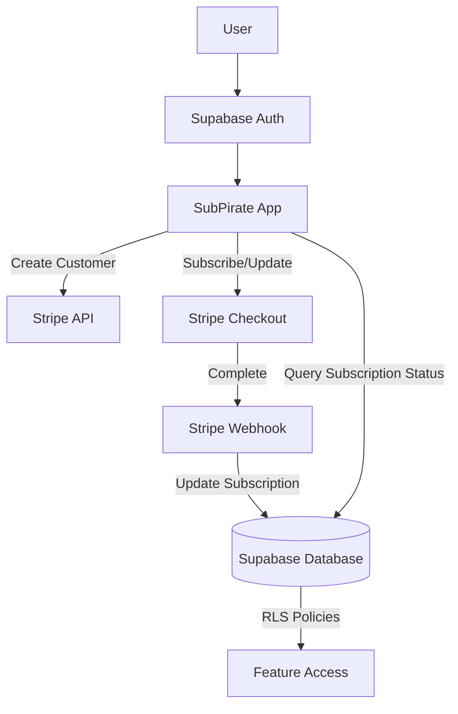
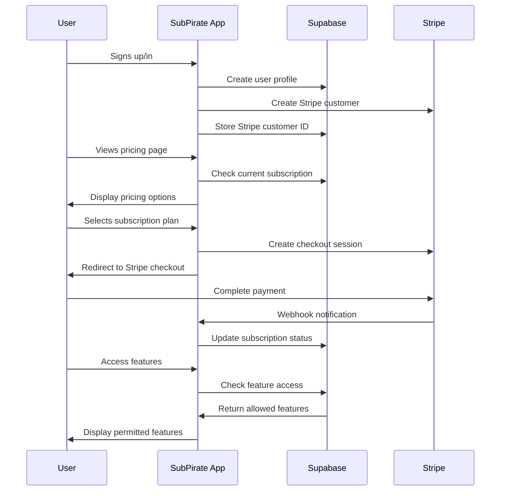
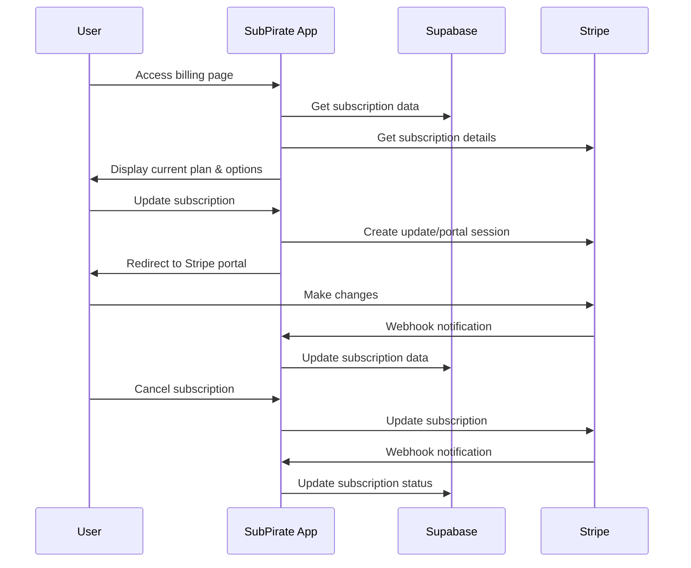

# Stripe + Supabase Integration with Basejump

> **Note:** For a complete and updated guide to the Stripe integration, please refer to the [Stripe Integration Guide](./STRIPE-INTEGRATION-GUIDE.md).

This document provides a step-by-step guide to implementing Stripe subscriptions with Supabase in SubPirate using the Basejump pattern.

## Architecture Overview



## User Subscription Flow



## Subscription Management Flow



## Integration Checklist

### Database Setup
- [x] Review existing Stripe-related migrations
- [x] Implement any missing tables/fields for subscription tracking
- [x] Set up RLS policies for subscription data

### Authentication Integration
- [x] Ensure Stripe customer creation on user signup (via Basejump)
- [x] Link Supabase user profile with Stripe customer ID (via Basejump billing_customers table)

### Stripe API Integration
- [x] Configure Stripe API keys in environment (done in client.ts and webhook.ts)
- [x] Implement client-side Stripe functions (createCheckoutSession, createPortalSession implemented)
- [x] Implement server-side API endpoints (products, prices, create-checkout-session, create-portal-session)
- [x] Configure Stripe webhook endpoint (webhook handler implemented)

### Subscription Management UI
- [x] Review/enhance account billing components (AccountBilling.tsx exists)
- [x] Implement subscription status display (AccountBilling.tsx shows status)
- [x] Add subscription management options (createCustomerPortalSession implemented)

### Feature Access System
- [x] Connect feature access with subscription tiers (FeatureAccessContext implemented)
- [x] Test feature gates with different subscription levels (FeatureGate component exists)
- [x] Implement graceful handling of subscription changes (refreshAccess() implemented)

### Testing
- [x] Test subscription creation flow (implemented in Pricing.tsx)
- [x] Test subscription updates and cancellations (implemented in AccountBilling.tsx)
- [x] Verify webhook handling and database updates (webhook handler with replay protection)
- [x] Test feature access based on subscription status (FeatureAccessContext & FeatureGate component)

### Deployment
- [x] Configure production environment variables (defined in environment setup)
- [x] Set up production webhook endpoints (documented in implementation steps)
- [x] Document subscription management for users (comprehensive documentation available)

## Overview

We use Basejump's approach for integrating Stripe with Supabase, which provides:

1. Personal and team account management
2. Subscription and billing management
3. Feature access control based on subscription plans
4. Row Level Security (RLS) for secure data access

## Implementation Steps

### 1. Database Setup

Run the following SQL migrations in your Supabase dashboard:

1. `basejump_integration.sql` - Core Basejump schema and utility functions
2. `basejump_feature_setup.sql` - Feature definitions and Stripe product mapping
3. `basejump_feature_access.sql` - Feature access control functions

### 2. Stripe Configuration

1. Create the following products in your Stripe dashboard:
   - Free Plan
   - Starter Plan
   - Creator Plan
   - Pro Plan
   - Agency Plan

2. For each product, create a corresponding price:
   - Free: $0/month
   - Starter: $19/month
   - Creator: $34/month
   - Pro: $49/month
   - Agency: $97/month

3. Make sure the product and price IDs match the ones in `basejump_feature_setup.sql`

4. Set up Stripe webhooks with the following events:
   - `checkout.session.completed`
   - `customer.subscription.created`
   - `customer.subscription.updated`
   - `customer.subscription.deleted`
   - `customer.created`
   - `customer.updated`
   - `product.created`
   - `product.updated`
   - `product.deleted`
   - `price.created`
   - `price.updated`
   - `price.deleted`

5. Configure the webhook endpoint to point to:
   ```
   https://your-domain.com/api/stripe/webhook
   ```

### 3. Environment Variables

Add the following environment variables to your project:

```
VITE_STRIPE_PUBLISHABLE_KEY=pk_test_...
VITE_STRIPE_SECRET_KEY=sk_test_...
VITE_STRIPE_WEBHOOK_SECRET=whsec_...
```

For production, replace test keys with live keys.

### 4. Usage in Code

The integration provides several ways to check feature access:

#### In Database Queries

```sql
SELECT * FROM some_table
WHERE public.current_user_has_feature_access('feature_key');
```

#### In React Components

```tsx
import { useFeatureAccess } from '../contexts/FeatureAccessContext';

function MyComponent() {
  const { hasAccess } = useFeatureAccess();
  
  if (!hasAccess('analyze_unlimited')) {
    return <UpgradePrompt />;
  }
  
  return <FeatureComponent />;
}
```

#### Using FeatureGate Component

```tsx
<FeatureGate feature="campaigns">
  <CampaignsFeature />
</FeatureGate>
```

## Maintenance

### Syncing Products from Stripe

We now have automated syncing of products and prices from Stripe to Supabase. The system works in two ways:

#### Automatic Sync via Webhooks

When products or prices are created, updated, or deleted in the Stripe Dashboard, webhooks automatically update the Supabase database. This ensures the application always displays current subscription plans.

For details about this system, see [STRIPE-PRODUCT-SYNC.md](./STRIPE-PRODUCT-SYNC.md).

#### Manual Sync

To manually sync all products and prices from Stripe (useful for initial setup or recovery):

```bash
npm run stripe:sync
```

This command fetches all products and prices from Stripe and updates the Supabase database.

### Testing Webhooks Locally

1. Run the development server:
   ```
   npm run dev:webhook
   ```

2. Use Stripe CLI to forward webhooks:
   ```
   stripe listen --forward-to http://localhost:4242/api/stripe/webhook
   ```

## Troubleshooting

### Common Issues

1. **Missing subscription data**: Ensure Stripe webhooks are properly configured and working
2. **Feature access not updating**: Call `refreshAccess()` from the FeatureAccessContext
3. **Database errors**: Check the SQL migrations have been applied correctly
4. **Product or price data not updating**: Check webhook logs; run `npm run stripe:sync` to manually sync
5. **Client showing outdated prices**: Clear browser localStorage to refresh cached data
6. **Webhook errors**: Verify the webhook secret in environment variables matches Stripe Dashboard

### Testing Mode

In development mode, all features are enabled by default. To test specific subscription plans:

1. Use the test Stripe dashboard to create subscriptions
2. Subscribe to different plans to test access control