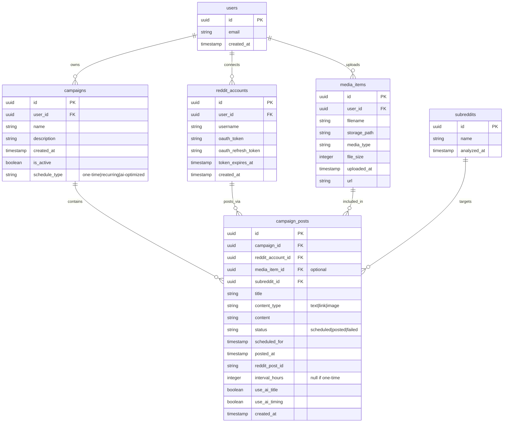
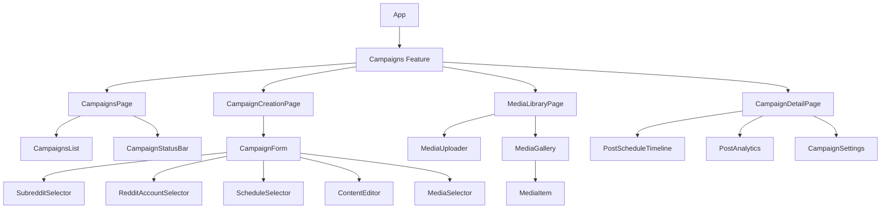
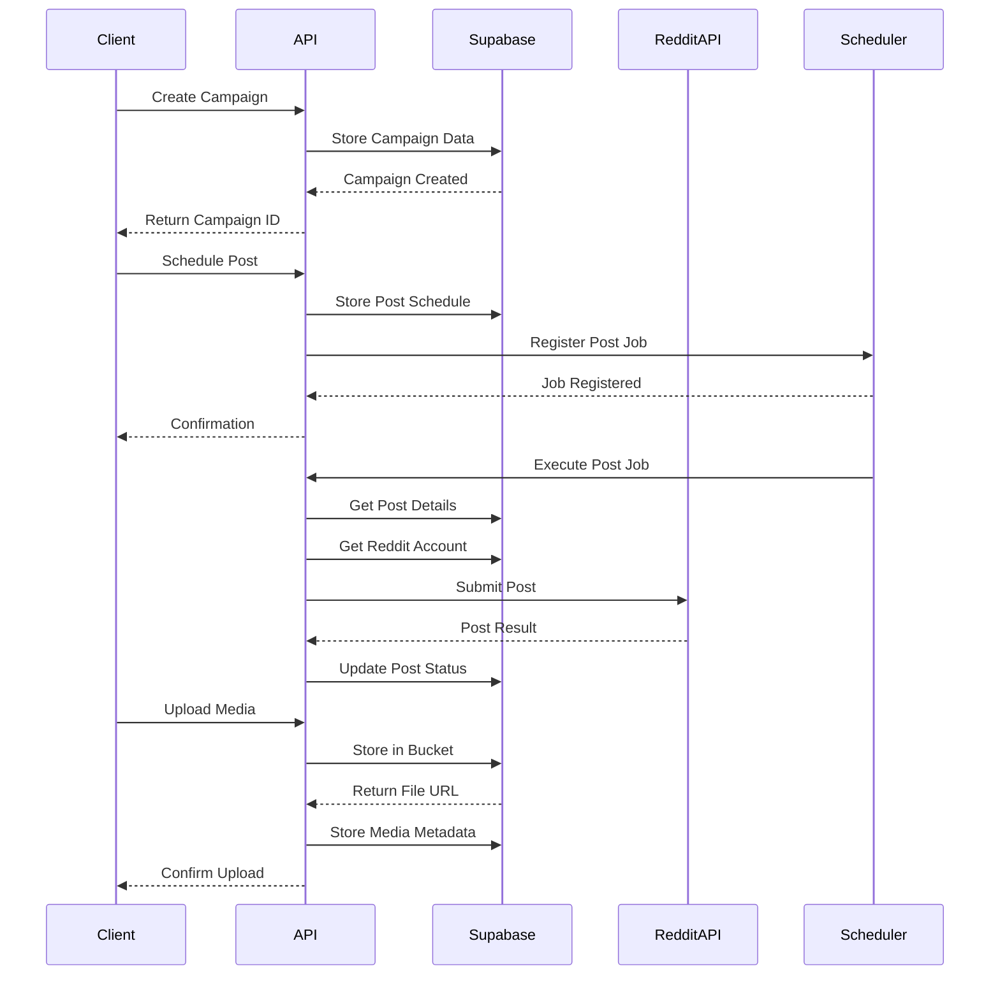
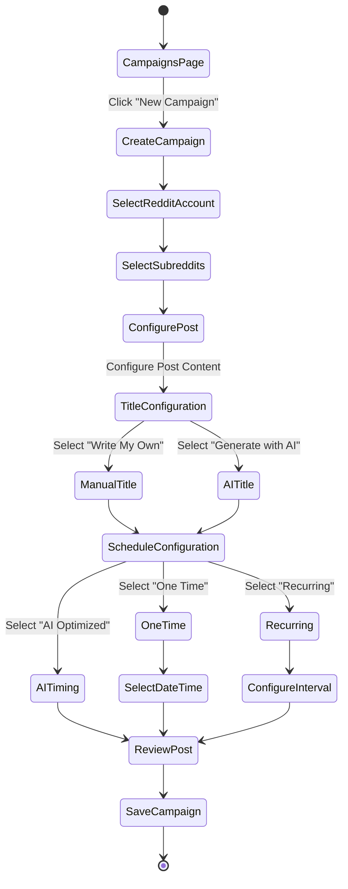
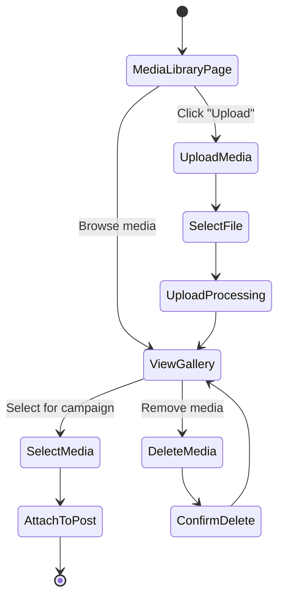

# Campaigns Feature PRD

## Overview
Campaigns is an automated Reddit posting agent that allows users to schedule and publish content to Reddit using their connected Reddit accounts. This feature enables strategic posting through manual scheduling, recurring intervals, or AI-optimized timing based on subreddit analysis data.

## User Stories
1. As a user, I want to schedule posts to specific subreddits at custom dates and times
2. As a user, I want to create recurring posting schedules (e.g., every 48 hours)
3. As a user, I want SubPirate to automatically determine optimal posting times based on subreddit analysis
4. As a user, I want to manually write post titles or use AI-generated titles based on subreddit analysis
5. As a user, I want to upload, store, and manage media for my posts in a gallery
6. As a user, I want to track the performance of my automated posts
7. As a user, I want to edit or cancel scheduled posts before they go live

## Feature Requirements

### Campaign Creation & Management
- Create, edit, view, and delete campaigns
- Set campaign name, description, and target subreddits
- Associate campaigns with specific connected Reddit accounts
- Dashboard view of all active/completed campaigns

### Post Configuration
- Set post content (text, link, images)
- Manual title entry or AI-assisted title generation
- Select posting schedule type (one-time, recurring, or AI-optimized)
- Date/time picker for manual scheduling
- Interval selection for recurring posts
- Preview post before scheduling

### Media Library
- Upload images to Supabase storage buckets
- Organize media in galleries
- Select media for campaigns
- Option for random media selection from library
- Delete/replace uploaded media

### Scheduling & Automation
- Background job system for scheduled posting
- Retry mechanism for failed post attempts
- Notification system for successful/failed posts
- Timezone handling for accurate scheduling

### Analytics
- Track post performance (upvotes, comments, engagement)
- Compare actual performance to predicted optimal times
- Historical view of campaign performance

## Technical Architecture

### Database Schema

### Component Architecture

### API Design

## User Flows

### Campaign Creation Flow

### Media Library Flow

## Implementation Plan

### Phase 1: Foundation
1. Create database schema for campaigns, posts, and media library
2. Implement Supabase storage integration for media uploads
3. Build API endpoints for CRUD operations on campaigns and media
4. Create base UI components for campaigns and media management

### Phase 2: Campaign & Media Features
1. Build campaign creation form with all configuration options
2. Implement media library with upload and gallery functionality
3. Create post scheduling system with different timing options
4. Integrate with existing Reddit account authentication

### Phase 3: Posting Automation
1. Build backend scheduler for executing posts at specified times
2. Implement retry and error handling for failed posts
3. Create notification system for post status updates
4. Build analytics tracking for post performance

### Phase 4: AI Enhancement
1. Integrate with subreddit analysis data for timing optimization
2. Implement AI title generation based on subreddit patterns
3. Add smart media selection based on performance data

## Feature Access Control
- Basic: Manual post scheduling (limited number)
- Pro: Recurring posts + media library
- Premium: AI-optimized posting times and title generation

## Security Considerations
- Reddit API tokens must be securely stored
- Row-level security policies for user data
- Rate limiting for API endpoints
- Validation of all user inputs

## Analytics & Monitoring
- Track success rate of automated posts
- Monitor Reddit API usage and limits
- Analyze post performance against prediction
- Track media storage usage

## Testing Strategy
- Unit tests for scheduling logic
- Integration tests for Reddit API posting
- End-to-end tests for campaign creation flow
- User acceptance testing for intuitive UX

# Campaigns Feature Documentation

This directory contains detailed documentation for the Campaigns feature, which enables automated scheduling and posting to Reddit.

## Getting Started

1. Review the [main documentation](../campaigns.md) for an overview of the feature
2. Follow the [setup guide](./setup.md) to enable the Campaigns feature
3. Configure [storage](./storage-setup.md) for media uploads
4. Set up the [scheduler](./scheduler-setup.md) for automatic post publishing

## Key Components

### Media Library

The [Media Library](./media-library.md) is a comprehensive media management system that allows users to:

- Upload, organize, and manage media assets for Reddit campaigns
- Browse media using multiple view modes (grid, list, table)
- Search and filter media using advanced criteria
- Perform bulk selection and operations on multiple files
- Preview media with detailed information and quick actions

This component provides the visual assets needed for image-based Reddit posts. See the [Media Library documentation](./media-library.md) for full details.

### Scheduler

The [Scheduler](./scheduler-setup.md) is a background service that:

- Runs continuously to check for scheduled posts
- Publishes posts at their scheduled times
- Creates the next occurrence for recurring posts
- Handles failures and retries gracefully

### AI Features

The [AI Features](./ai-features.md) enhance campaigns with:

- Optimal posting time determination
- Title generation based on subreddit analysis
- Performance prediction and recommendations

## Technical Reference

For developers working on the Campaigns feature, here are the key technical resources:

- [Storage Setup](./storage-setup.md): How media is stored in Supabase
- [Scheduler Setup](./scheduler-setup.md): How the posting service works
- [AI Features](./ai-features.md): How AI augments the posting experience
- [Media Library](./media-library.md): How the media management system works

## Development Workflow

To add new capabilities to the Campaigns feature:

1. Understand the existing code in `src/features/campaigns`
2. Review the database schema in `migrations/campaigns_feature.sql`
3. Ensure you handle RLS policies for security
4. Update documentation to reflect your changes

## Integration Points

The Campaigns feature integrates with:

- **Reddit API**: For posting content to Reddit
- **Supabase Storage**: For storing media assets
- **Supabase Auth**: For user authentication and security
- **Supabase Database**: For storing campaign data
- **Subreddit Analysis**: For AI-assisted timing and content optimization